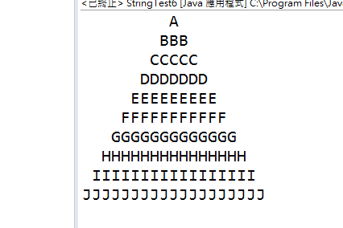

## 作業 No. 10 練習處理分析文字內容
 
### PART I: 統計一段英文文字中的各項統計數字
   1. 請隨意到網路上抓取一段英文文章(例如: https://www.royal.uk/speeches 裡面挑選一段英國女王的公開談話), 存入到一個String物件中
   2. 請計算文章中每一個英文字母(不區別大小寫)出現的次數
   3. 文章中的任何非英文字母(例如數字,空白,標點符號等)也計算其出現的總共次數
   4. 最後將文章中長度超過10個字元的英文字列印出來
   
### PART II: 利用StringBuilder來列印以下的三角形圖示

   - 使用StringBuilder物件
   - 三角形的高度可由鍵盤輸入
   - 利用迴圈將字串內容append()到該StringBuilder物件中
   - 最後將StringBuilder物件利用toString()方法轉成String物件然後印出來
