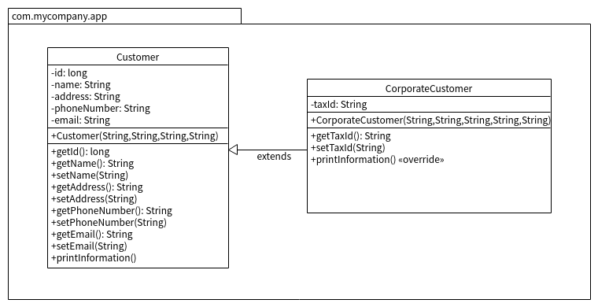

## 作業 No. 12 : 類別繼承

### 延續`作業11`所寫的電子商務系統, 請以Customer類別為父類別定義其子類別CorporateCustomer

類別圖如下:

   - 增加taxId 實體變數(代表公司的統一編號)
   - 建構子(參數列為String name, String address, String phoneNumber, String email, int taxId)
   - 存取taxId的 getter/setter方法
   - 列印資訊的 printInformation()方法
      - 覆蓋父類別的printInformation()方法
      - 利用super來呼叫父類別的printInformation()方法
   - 主要類別CustomerTest的main()內產生CorporateCustomer物件, 呼叫printInformation()
