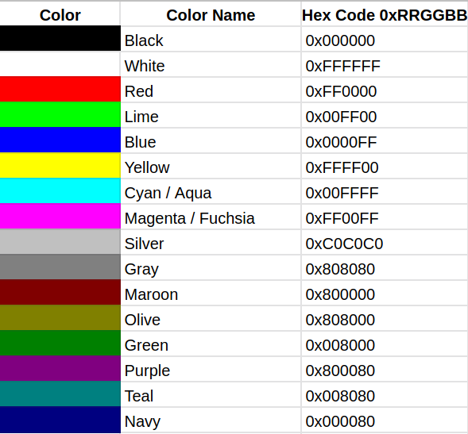

## 作業 No. 3
   
### 練習使用多重決策if - else if - else

1. 從鍵盤輸入0-100的一個整數分數
2. 判斷分數的級距給予等級, 規則如下:
   - 90-100 : 等級'A'
   - 80-89 : 等級'B'
   - 70-79 : 等級'C'
   - 60-69 : 等級'D'
   - 0-59 : 等級'E' 
   - 其他分數: 列印"輸入錯誤!"訊息
3. 最後列印出等級
   

### 練習使用switch case

1. 在作業No.2的Rgba類別中加入`public String colorName`成員變數, 用來儲存顏色名稱
2. 加入以下成員方法:

	```java
	public void setColorName(String name) {
		colorName = name;
	}
	public void setColorName(int r, int g, int b) {
		String name = String.format("%02X%02X%02X", r, g, b);
		colorName = name;
	}
	```

3. 在建構子中呼叫`setColorName(red, green, blue);` 來設定colorName
4. 加入新的建構子 

	```java
	public Rgba(int color, String name) {
		red = color >>> 24;
		green = (color & 0x00ff0000) >> 16; 
		blue = (color & 0x0000ff00) >> 8;
		alpha = color & 0x000000ff;
		setColorName(name);
	}
	```

5. 在invertColor()方法中呼叫`setColorName(red, green, blue);` 來設定colorName
6. 新增一個static方法, 可以輸入顏色名稱來產生Rgba物件

   - 新增的方法為: `public static Rgba stringToRgba(String name)`
   - 顏色名稱與實際RGB代碼對應如下: 
   - 利用以下switch case架構, 根據顏色名稱name來指定顏色RGB代碼colorCode:
   
	```java
	int colorCode;
	switch (name) {
		case "White":
			colorCode = 0xFFFFFF;
			break;
		//其他cases...
		//預設case: 指定黑色
		default:
			name = "Black";
			colorCode = 0x000000;
	}
	```
   
   - colorCode需加入alpha值255(0xFF)
   - 最後輸出Rgba物件: `return new Rgba(colorCode, name)`
   
7. 更新displayColorButton()如下:

	```java
	public void displayColorButton() {
		JFrame f = new JFrame();
		f.setLocation(pos += 300, 1);
		f.setDefaultCloseOperation(JFrame.EXIT_ON_CLOSE);
		FlowLayout bl = new FlowLayout();
		f.setLayout(bl);
		f.setTitle("Color " + serial++ + ":" + colorName);
		f.setSize(250, 250);
		JButton b = new JButton("Color");
		b.setFont(new Font("Arial", Font.PLAIN, 80));
		b.setPreferredSize(new Dimension(250, 250));
		b.setBackground(Color.BLACK);
		b.setForeground(toColor());
		f.add(b);
		f.setVisible(true);
	}
	```

8. RgbaTest 主要類別:

	```java
	public class RgbaTest {

		public static void main(String[] args) {
			String colorName = "Teal";
			Rgba r1 = Rgba.stringToRgba(colorName);
			r1.displayColorButton();
			//
			colorName = "Maroon";
			r1 = Rgba.stringToRgba(colorName);
			r1.displayColorButton();
			//
			colorName = "Olive";
			r1 = Rgba.stringToRgba(colorName);
			r1.displayColorButton();
			r1.invertColor();
			r1.displayColorButton();
			//
			Rgba r2 = new Rgba(0x7FFF00FF);
			r2.displayColorButton();
		}

	}
	```

### 相關教學影片[連結](https://youtu.be/mnaEn4nhZo4)
   - 不知道如何開始着手的同學可以參考上面youtube影片.
   
