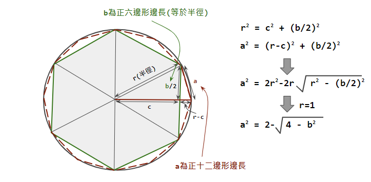

## 作業 No. 4
   
### 練習使用迴圈語法來計算圓周率
   - π (pi) 是圓周與直徑的比例
   - 計算π數值的演算法最早是在西元前250年由希臘數學家阿基米德所發明的正多邊形的幾何算法
   - 阿基米德的算法是利用圓的外切正六邊形(circumscribed hexagons )及內接正六邊形(inscribed hexagons)的周長，以此計算 π 的上限及下限，之後再將六邊形變成十二邊形，繼續計算邊長，一直計算到正96邊形為止
   - 這個練習僅利用內接正多邊形的周長來做為圓周的估計值
   - 可以從正6邊形開始,然後計算12邊形, 24邊形, 48邊形,...等的邊長
   - 
   - 上圖展示了如何從正6邊形邊長來計算正12邊形的邊長
      - 可以假設半徑為1, 則正六邊形的邊長也等於1
   - 利用迴圈, 
      - 第一個循環計算正6邊形周長, 然後計算圓周率(周長與直徑的比例)
      - 第二個循環計算正12邊形周長, 然後計算圓周率
      - 原則上當使用的多邊形邊數越多, 則圓周率會越接近真實數值 
      - 如果發現所計算的圓周率數值開始不增反減, 則代表所使用的浮點數因為精密度不夠而開始產生誤差, 就不需要使用更多的邊數去計算而應該停止.
      
   

   
