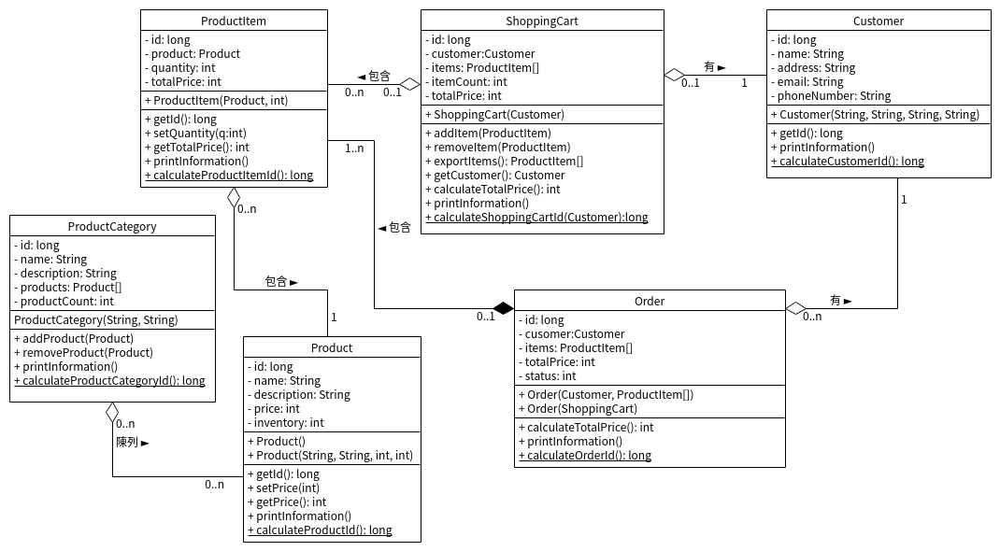

## 作業 No. 6

### 完成課程中所舉例的電子商務系統裡面的ShoppingCart類別的定義
   - 課程中物件導向分析設計單元所規劃的電子商務系統, 根據類別圖(Class Diagram)及類別之間的關係, 完成`ShoppingCart`(購物車)類別的定義 
   - 類別關係圖
   - `ShoppingCart`類別圖
   - `ShoppingCart`類別包含:
      - 成員變數: 
         - public long id;
	    - public Customer customer;
	    - public ProductItem[] items;
	    - public int itemCount; // 用來記錄購物車中產品項目數量
	    - public int totalPrice;
      - 建構子:
         - public ShoppingCart(Customer c)
            - Customer物件為參數, 目的是將以Customer物件的id作為ShoppingCart物件的id
            - items = new ProductItem[10]; // 假設購物車最多可以包含10個Product items
      - 成員方法:
         - public void addItem(ProductItem i): 加入ProductItem, 須過濾重複加入的ProductItem
         - public void removeItem(ProductItem i) : 移除ProductItem, 須先檢核該ProductItem物件有在購物車裡面, 再做移除
         - public int calculateTotalPrice() : 計算購物車內商品項目的總價格
         - public void printInformation() : 列印購物車資訊
      - 靜態(static)方法: 
         - calculateShoppingCartId(): 產生ShoppingCard id數值(等於Customer id)
	
         
