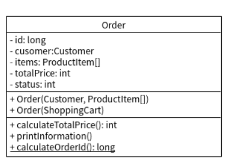

## 作業 No. 7

## Part I:
### 延續`作業6`所寫的電子商務系統, 根據`ShoppingCart`物件內容來產生`Order`物件
### ShoppingCart 類別:
   - 增加`exportItems()`方法: 用來匯出`ShoppingCart`物件中所包含的`ProductItem[]`陣列
       - 匯出`ProductItem[]`陣列時, 需根據實際的`ProductItem`數目(記錄在`itemCount`成員變數中)來產生這個陣列
       - 可以利用`System`類別的`arraycopy()`[方法](https://docs.oracle.com/javase/7/docs/api/java/lang/System.html#method_summary):
           - public static void arraycopy(Object src,int srcPos,Object dest,int destPos,int length)
   - 增加`getCustomer()`方法, 回傳Customer物件
### Order 類別:
   - `Order`類別圖:
   - 增加`Order(ShoppingCart)`建構子, 接受ShoppingCart物件為參數
       - 從`ShoppingCart`物件可取得`Customer`物件(`getCustomer()`方法), 再利用`exportItems()`可取得`ProductItem[]`陣列
       - 可參考`Order(Customer, ProductItem[])`建構子的內容來撰寫

## Part II:
### 請以遞迴方式實作河內塔(Hannoi Tower)問題
   - 輸入盤子的數目
   - 可以參考該[連結](https://zh.wikipedia.org/wiki/%E6%B1%89%E8%AF%BA%E5%A1%94)

### 相關教學影片[連結1](https://youtu.be/9NUyAWoDLgM) , [連結2](https://youtu.be/g6d96IjDOf0)
   - 不知道如何開始着手的同學可以參考上面youtube影片.
